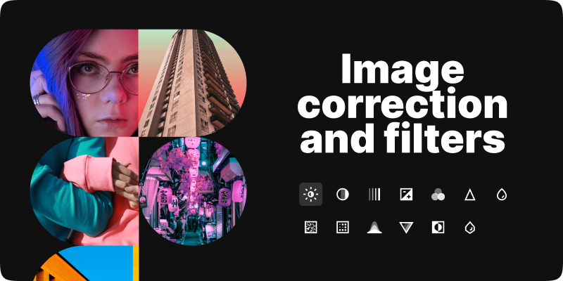

# SVG To Image

Use SVG as raster images in Figma. A simple solution for SVG import.

Since at the moment Figma can't paste SVG images as a fill, so you can use this plugin.

There are two ways how you can paste SVG:

-   From a file
-   From your clipboard. It could be a slow method if you use complex images because of the approach used in the plugin.

You can also scale your image when you import it, as you usually do when you export images in Figma — by scale (@2x, @3x, etc.) by width or height. All these scale modes have restrictions for the maximum value.

[Install Plugin](https://www.figma.com/community/plugin/891448180042913164)

Check the demo on [Youtube](https://youtu.be/8jlZCFvIhdo)

Enjoy!

Any question please leave in the Issues or send me directly at [laptev.graphics@gmail.com](mailto:laptev.graphics@gmail.com)
